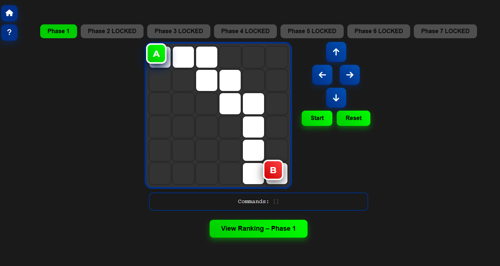
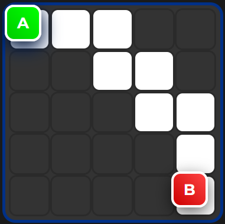
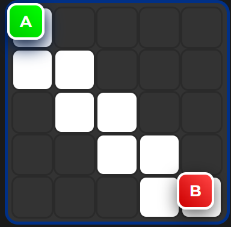
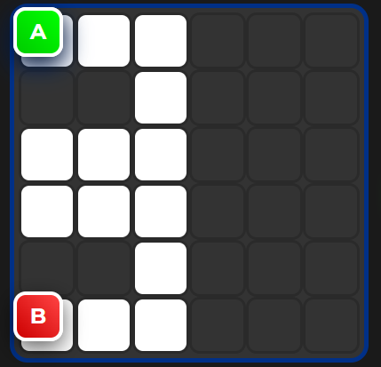

# Desafio Caminho do Código

  

**Code Path Challenge** (em inglês) / **Desafio Caminho do Código** (em português)  

Um puzzle de programação simples e desafiador onde você guia um cubo do ponto A até o ponto B usando comandos direcionais. Aprenda conceitos de programação como funções, recursão e otimização de código enquanto resolve fases cada vez mais complexas!

👉 **Jogue agora:** [https://luisturra.github.io/code-path-challenge/]

## 📸 Screenshots

  
  
  

## 🎮 Como Jogar

- Clique nos botões de direção (↑ ↓ ← →) para adicionar comandos ao programa principal.
- Pressione **Iniciar** para executar e ver o cubo se mover.
- O cubo deve ficar sempre no caminho branco e chegar ao ponto B (vermelho).
- A partir da **Fase 3**: você tem limite de comandos principais → use a **FUNÇÃO (F1)** para reutilizar sequências!
- A partir da **Fase 7**: surge a **FUNÇÃO 2 (F2)** – você pode chamar F1 dentro de F2 e vice-versa (cuidado com loops infinitos!).
- A partir da **Fase 9**: alguns comandos de direção ficam bloqueados em certas fases.

**Objetivo por fase**: Complete com o menor número de comandos possível para dominar o ranking global!

## 🏆 Ranking Global

- Ao completar uma fase, envie seu nome e score para o leaderboard mundial.
- Veja os melhores tempos e tamanhos de código de jogadores do mundo todo.
- Seja o #1! 🥇

## 🌍 Idiomas

O jogo está disponível em:
- Português (PT-BR)
- Inglês (EN)

Mude o idioma no menu.

## ☕ Apoie o Projeto

Se gostou do jogo e quiser apoiar o desenvolvimento, considere um café virtual:  
  

## 🛠️ Tecnologias Usadas

- HTML5, CSS3 e JavaScript puro
- Firebase Firestore (para leaderboard global)
- Font Awesome (ícones)
- Traduções com sistema simples de i18n

Sem frameworks pesados – tudo leve e rápido!

## 📂 Estrutura do Projeto
    /
    ├── index.html          # Página principal
    ├── styles.css          # Estilos
    ├── script.js           # Lógica do jogo
    ├── phases.js           # Definições das fases
    ├── images/             # Imagens das fases, ícones, etc.
    └── README.md           # Este arquivo

## 🤝 Contribuições

Quer ajudar a melhorar o jogo?
- Adicionar novas fases
- Melhorar traduções
- Corrigir bugs
- Sugerir features

Faça um fork, crie uma branch e envie um Pull Request! Toda ajuda é bem-vinda. ❤️

## 📄 Licença

Este projeto é open-source sob a licença MIT.  
Sinta-se à vontade para usar, modificar e distribuir.

---

Feito com ❤️ por [Luis Henrique Turra Ramos](www.linkedin.com/in/luis-turra-786442251)  

Divirta-se programando caminhos! 🚀